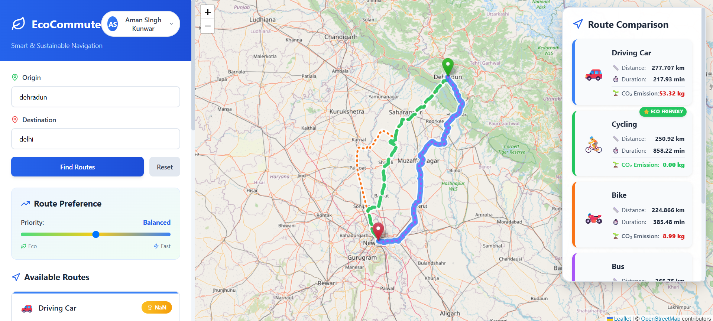
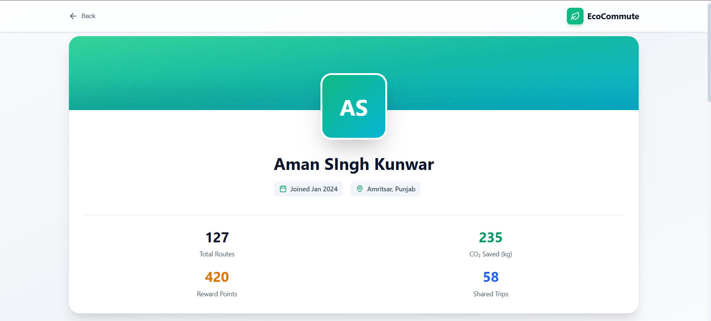

# 🌱 EcoCommute

> **An eco-commute involves using environmentally friendly transportation methods to reduce your carbon footprint, traffic congestion, and air pollution.**

---

## 📌 Overview

**EcoCommute** is an AI-enabled, sustainable transport planner that helps users find eco-friendly and time-efficient routes.  
It integrates multiple data sources — including weather, emissions, and live traffic — to recommend optimized travel choices.

🔗 **Live Website:** [https://ecocommute-frontend.onrender.com/](https://ecocommute-frontend.onrender.com/)  
💻 **Repository:** [EcoCommute GitHub Repo](https://github.com/Aman-Singh-Kunwar/EcoCommute)

---

## 🧠 Project Architecture

```
EcoCommute/
│
├── backend/ # Node.js + Express backend
│ ├── src/
│ │ ├── db/ # MongoDB connection
│ │ ├── middleware/ # Auth middleware
│ │ ├── models/ # Mongoose models
│ │ ├── routes/ # API endpoints
│ │ ├── services/ # ORS, Weather, ML, Emission APIs
│ │ └── utils/ # Helper functions
│ └── scripts/ # Demo seed data
│
├── frontend/ # React + Tailwind frontend
│ ├── src/
│ │ ├── assets/ # Images and icons
│ │ ├── components/ # Reusable UI components
│ │ ├── context/ # AuthContext
│ │ ├── pages/ # Page components
│ │ ├── services/ # API communication (Axios)
│ │ ├── styles/ # Tailwind & CSS files
│ │ └── main.jsx # App entry point
│
├── mi_service/ # ML model service (Python + Flask)
│ ├── data/
│ ├── model/
│ ├── app.py
│ └── requirements.txt
│
├── infra/ # Docker and environment setup
│ ├── Dockerfile.backend
│ ├── Dockerfile.frontend
│ ├── Dockerfile.ml
│ └── docker-compose.yml
│
├── docs/ # Documentation and architecture details
└── scripts/ # Dev environment setup
```

---

## ⚙️ Tech Stack

**Frontend:**

- React + Vite
- Tailwind CSS
- Leaflet (Maps)
- Lucide React (Icons)
- React-Toastify (Notifications)
- Axios (API calls)

**Backend:**

- Node.js, Express.js
- MongoDB (Database)
- REST APIs Integration (ORS, OpenWeather, Carbon Interface)

**Machine Learning Service:**

- Python (Flask)
- scikit-learn (Predictive model)

**Infra & DevOps:**

- Docker, Docker Compose
- GitHub & Render Hosting

---

## 🌍 External APIs Used

| API Name                   | Purpose                     |
| -------------------------- | --------------------------- |
| **ORS (OpenRouteService)** | Route optimization          |
| **OpenStreetMap**          | Map rendering               |
| **OpenWeather API**        | Real-time weather data      |
| **Carbon Interface API**   | Carbon emission calculation |
| **Emission API (custom)**  | Eco-score computation       |

---

## ✨ Features

- 🔍 **Eco-Route Optimization:** AI-driven suggestions for sustainable routes
- 🌦️ **Weather-Aware Routing:** Adjusts paths based on live weather
- 🌱 **Carbon Emission Tracker:** Shows estimated emissions saved
- 🧭 **Interactive Map:** Built with Leaflet for real-time route visualization
- 🧑‍💻 **User Authentication:** Secure login/signup with JWT
- 📊 **Dashboard:** Displays eco-statistics and trip summaries
- 🧠 **ML Prediction:** Predicts traffic delay & eco-score

---

## 🚀 Getting Started

Open the website → EcoCommute Live

Sign up or log in

Select your source and destination

Choose eco-friendly routes suggested by AI

View weather, emissions, and route comparison

---

## 📝 Documentation

📸 Screenshots



---

## 🧭 Future Improvements

🛰️ Integration with live traffic APIs

📱 Mobile-responsive PWA version

💬 Smart chatbot for eco-travel tips

⚡ Enhanced analytics dashboard

---

## 👥 Team Members

| Name                  | Role                                | GitHub                                                    |
| --------------------- | ----------------------------------- | --------------------------------------------------------- |
| **Aman Singh Kunwar** | Frontend Developer                  | [Aman-Singh-Kunwar](https://github.com/Aman-Singh-Kunwar) |
| **Deepak Singh**      | Backend Developer                   | [Deepaksingh1227](https://github.com/Deepaksingh1227)     |
| **Harikesh**          | Full-Stack Integration & Deployment | [Harikesh312](https://github.com/Harikesh312)             |
| **Lucky Singh**       | Contributor / Support               | [luckysingh25](https://github.com/luckysingh25)           |

---

## 🧾 License

This project is licensed under the MIT License — feel free to use and modify with credit.

---

## ⭐ Acknowledgments

OpenRouteService

OpenWeather

Carbon Interface

Leaflet

Render Hosting

---
